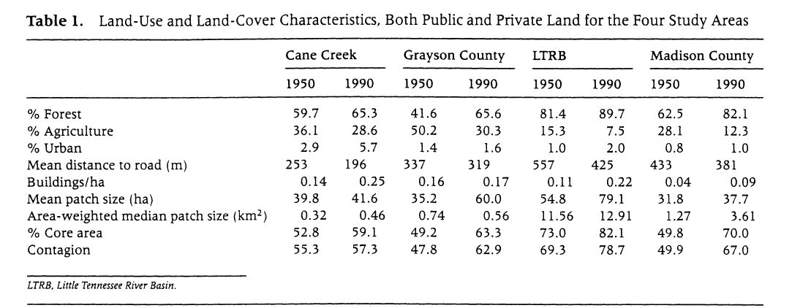
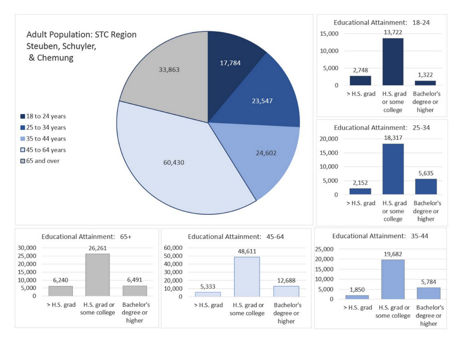
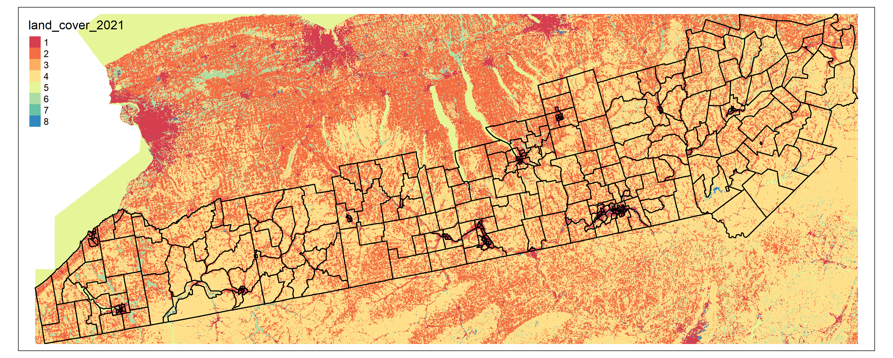

Determining Land Cover, Population, and Economic Changes in NY
Appalachia (2010-2021)
================
Stephen Sanders

# Introduction to Problem/Question

# Problem / Question

Analyze land cover changes between 2010 and 2019 (and between 2019 and
2021?) in the 14 NYS-based Appalachian counties (AKA the “Southern
Tier”) relative to changes in population and economic indicators,
including total population, poverty level, and unemployment as a way to
assess the area.

*Notes: the title is very much a work-in-progress. I am also still
finalizing the time period of study. The first year may be pushed back
to the earliest available year for which the ACS has estimates. It would
be 2009 if only using 5-year estimates, and 2005 if using 1-year
estimates.*

# Inspiring Examples

## Example 1

This is Figure 5 in [Suraj et al
(2024)](https://doi.org/10.3390/land13091541), and is a great example of
a map showing what I would need to show in my analysis. Once I complete
the analysis and arrive to a raster object that contains all the land
cover change data for the region, I could create a map using tmap with a
legend showing all the different changes (as you see in the image).

## Example 2

 This is Table 1 in [Wear &
Bolstad (1998)](https://www.jstor.org/stable/3658757). I would like to
create a table similar to this that would only show the first three rows
(and maybe % grassland) for each subregion and/or county for the years
2010, 2014, and 2019. A table like this would help show the basic make
up of the region’s land cover profile. It could be created using the gt
package.

## Example 3

This collection of charts comes from the [2016 Comprehensive Economic
Development
Strategy](https://www.stcplanning.org/document/stcs-2016-ceds/) report
(pg. 6) by the Southern Tier Central Regional Planning & Development
Board. I really like the way these charts are grouped together, and I
can see myself formatting visuals in this manner to show certain data
points by subregion or county. I could create the charts using ggplot2
and then figure out a way to lay them out together.

# Proposed data sources

- American Community Survey (ACS) data pulled using the
  [tidycensus](https://github.com/walkerke/tidycensus) package.
- [LCMAP
  data](https://www.usgs.gov/special-topics/lcmap/collection-13-conus-science-products)
  from the USGS.

# Proposed methods

- Pull ACS data at the tract level for each year between 2010 and 2021
  (or whatever the years end up being) using the tidycensus package.
  - Variables include total population, poverty level, and unemployment.
    I will end up pulling many of the variables considered in [this 2012
    study by Ludke et al](https://www.jstor.org/stable/23337708),
    including employment type/industry.
- Join and mutate data to create variables related to change (e.g.,
  poverty level, unemployment) and create a single dataframe for the
  relevant time period.
- Download LCMAP data for each of the focus years (at least 2010, 2014,
  2019, and 2021).
- Categorize LCMAP data correctly, which should be automatic using
  appropriate categories (see pg. 7 of [this
  report](https://d9-wret.s3.us-west-2.amazonaws.com/assets/palladium/production/s3fs-public/media/files/LSDS-2346%20Land%20Change%20Monitoring%2C%20Assessment%2C%20and%20Projection%20%28LCMAP%29%20Collection%201.3%20Data%20Format%20Control%20Book%20%28DFCB%29%20-v1.0%20%202022_07_12.pdf)
  for the categories).
- Calculate percentage of land cover types (e.g., tree cover, cropland,
  etc.) for each census tract and county in each of the study years.
  - This could enable me to compare the 3 subregions within NY-based
    Appalachia (West Region, Central Region, 8 Region).
- Look for any trends between changes in population/economic indicators
  and land cover over the study area (see Current Issues).

## Main Packages Used

- Graphs will be created using
  [ggplot2](https://github.com/tidyverse/ggplot2/).
- Maps will likely be created using
  [tmap](https://github.com/r-tmap/tmap) and possibly
  [leaflet](https://github.com/rstudio/leaflet/).
- Tables will be created using [gt](https://github.com/rstudio/gt/).
- [terra](https://github.com/rspatial/terra) will be used to load
  in/process the LCMAP data.
- Other [tidyverse](https://www.tidyverse.org/) packages will be used to
  process all data, especially the data from the ACS.

## Current Issues

- The LCMAP files are large and take up a good amount of space. I have
  to figure out a way to load them into a raster object without having
  to download them to my computer.
- I still have to work out exactly how I am going to compare land cover
  between years and turn that into RasterLayers for a map. I may take
  some influence from [Suraj et al
  (2024)](https://doi.org/10.3390/land13091541), although I’m not sure I
  have the skill set required to run an analysis that fully resembles
  their study.
- Even more pertinent, I have to figure out how to do the final step of
  comparing land cover changes vs. population/economic indicator changes
  (i.e., what is the best way to show any trends/correlations in these
  changes?)

# Expected Results

Ideally, I am able to create graphics similar to the 3 examples included
above. I am going to need maps of the land cover for each relevant year
and then a map of the change in land cover between the time period of
study.

 I created this preliminary image
above using land cover data and census tract boundaries from 2021. I
will be making a map like this for each year that I will be focusing on
(at least 2010, 2014, and 2019, although it depends on my finalized time
period).

Other than land cover maps, I will also include maps of certain
variables at the census tract level (and possibly at the county level,
as well). Important variables to display in this manner include poverty
level and unemployment.

I am also going to create tables of certain data (e.g., see caption of
Example 2) to provide some general insight into the characteristics of
the region. Scatter, line, and bar charts will also be created for the
same reason. I may include a regression analysis or other things if I
have time and they ultimately help illustrate my results.
